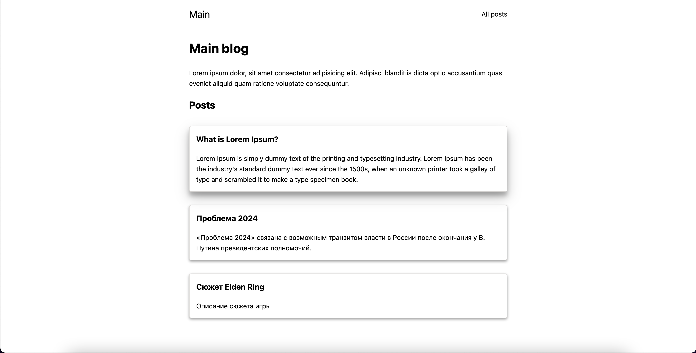
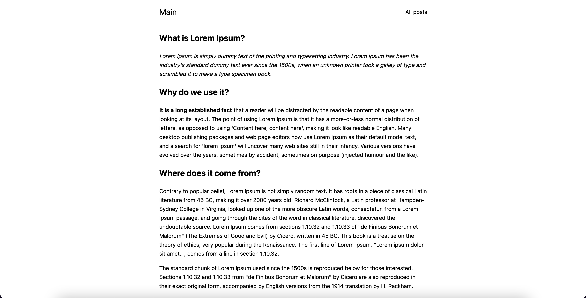

# Шаблон проекта Next + Strapi

## Обзор

`Strapi` — headless CMS. Помогает создавать контент через админку, и получать его на фронте через REST или GraphQL. Подробнее [можно почитать на сайте](https://strapi.io/).

В шаблоне есть главная страница с коротким списком статей, страница со всеми постами и динамическая страница для конкретного поста. Использууется базовый минималистичный стиль, реализованный с помощью `Sass`.

---

Проект включает в себя базовые страницы и компоненты для блога на `Next.js` в связке с `Strapi`. Для получения данных используется `axios`, для конвертации markdown в html - `markdown-it`.
